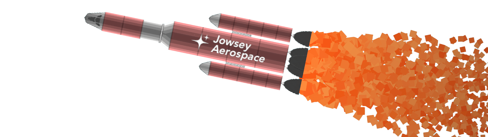

# Juno

AI evolves to launch a multi-stage rocket into orbit. A Unity 6.3 project.

Each individual has a genome containing flattened weights for a makeshift neural network. The network receives the state of the ship and
outputs controls for thrust, steering, and separating stages each frame.

Despite begin given 10 inputs of debatable quality and an admittedly very finnicky test env, a network with just 1 layer of 8 neurons is
capable of effectively reaching orbit from launch over the course of 3 minutes, making effective use of each stage, and even learning to
coast through atmospheric drag!